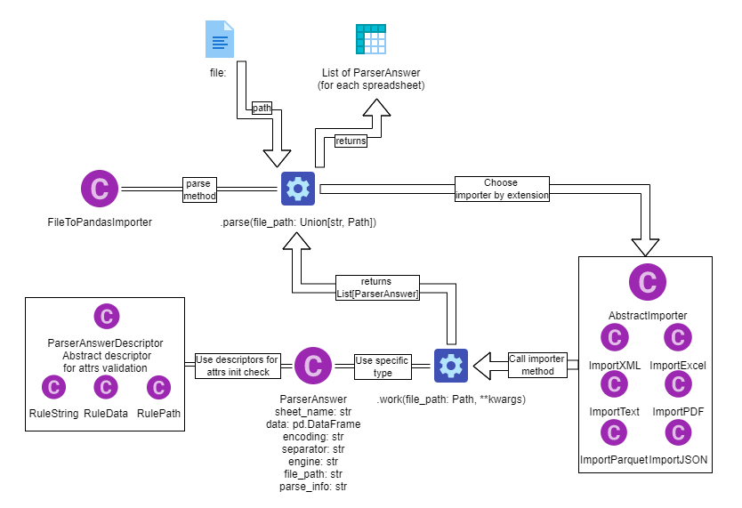

# Almost-any-file to Pandas dataframe

## Module description

Main class FileToPandasImporter
1. Receive file path with ".parse(path: str)" method
2. Verify file format, permission and select the parser
3. Determine the number of sheets (for table or tree-like files xml, xlsx, xlsx)
4. Verify encoding and delimiter for text files
5. Convert file to pandas DataFrame

Tested formats: .xml(MS schema), .xls, .xlsx, .xlsb, .txt, .csv, .pdf(only with internal spreadsheet markup, unpredictable result)

Should work: .pickle(depends on creator's pandas version), .json, .parquet
  
## Retutns

The .parse(path: str) method returns a list of ParserAnswer instances, with attributes:
- sheet_name: str
- data: pd.DataFrame
- encoding: str
- separator: str
- engine: str
- file_path: str
- parse_info: str

## Use pattern

```
>>> parser = FileToPandasImporter()
>>> parsing_result = parser.parse('file_name.xlsx')
>>> parsing_result
[Parse result for: E:\_pandas_importer\file_name.txt (sheet name: Text file content)
 	Used engine:    ImportText
 	Encoding:       windows-1251
 	Text separator: |
 	Parsed columns: 3
 	Parsed rows:    3
 	Status:         OK]

>>> type(parsing_result)
<class 'list'>

>>> type(parsing_result[0])
<class '__main__.ParserAnswer'>

>>> type(parsing_result[0].data)
<class 'pandas.core.frame.DataFrame'>

>>> parsing_result[0].data
    0   1   2
0   r0c0    r0c1    r0c2    
1   r1c0    r1c1    r1c2   
2   r2c0    r2c1    r2c2   
3 rows x 3 columns
```
## App structure


